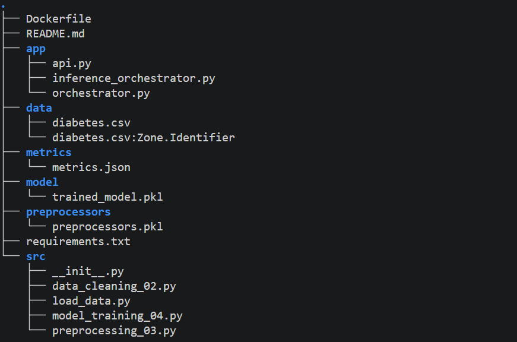
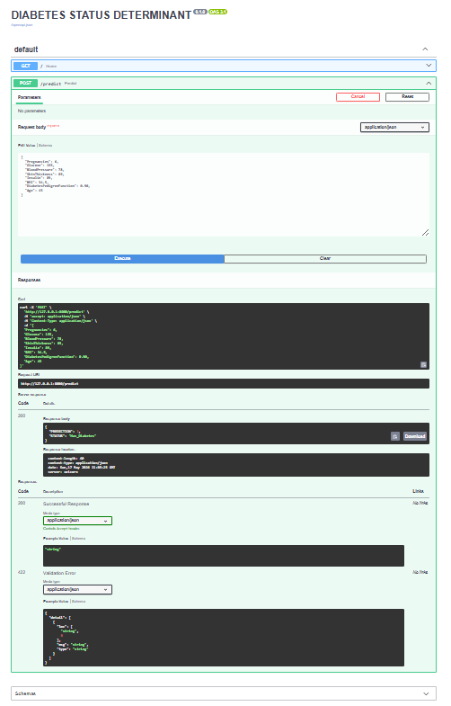

## 🚀 Diabetes Prediction with API and Docker
This project delivers a complete end‑to‑end machine learning system for predicting diabetes using clinical features. It includes data preprocessing, model training, inference orchestration, and a fully containerized FastAPI service ready for deployment.


#### 📌 Project Structure



```bash
tree -I "venv|__pycache__|.git"
```

#### 🧠 Features

- End‑to‑end ML workflow (data -> preprocessing -> model training -> inference)

- Preprocessing dictionary applied in correct order

- FastAPI endpoint for real‑time predictions

- Interactive CLI inference mode

- Fully containerized with Docker

- Clean, production‑ready structure


#### ⚙️ Run Locally (Without Docker)

`Start the API from the terminal`

```bash
uvicorn app.api:app --reload
```

`Open in Browser with the swagger UI`
```bash
http://127.0.0.1:8000/docs
```

#### 🐳 Run with Docker

`Build the Image`
```bash
docker build -t diabetes-api .
```

`Run the container`
```bash
docker run -p 8000:8000 diabetes-api
```

`Access the API`
```bash
http://127.0.0.1:8000
```

`Swagger UI`
```bash
http://127.0.0.1:8000/docs
```

`Sample FASTAPI Swagger UI`




#### 📥 Sample Prediction Request

```bash
{
  "Pregnancies": 6,
  "Glucose": 135,
  "BloodPressure": 78,
  "SkinThickness": 89,
  "Insulin": 89,
  "BMI": 34.5,
  "DiabetesPedigreeFunction": 0.90,
  "Age": 45
}
```

#### 📤 Sample Response

```bash
{
  "PREDICTION": 1,
  "STATUS": "Has_Diabetes"
}
```

#### 🧩 Technologies Used

- Python 3.10

- FastAPI

- Uvicorn

- Scikit‑learn

- Pandas

- NumPy

- Docker


#### 📄 License
This project is open for learning, modification, and extension.

#### 🤝 Collaboration & Cloning
You are welcome to collaborate, improve the project, or use it as a foundation for your own ML API deployments.

`Clone Repository`

```bash
git clone https://github.com/larrysman/diabetic-prediction-with-API-and-Docker.git
```

`cd into the project folder`
```bash
cd diabetic-prediction-with-API-and-Docker
```

`Create and Activate a Virtual Environment`

```bash
python3 -m venv venv
source venv/bin/activate   # Linux / macOS
venv\Scripts\activate      # Windows
```

`Install Dependencies`

```bash
pip install -r requirements.txt
```

`Contribute`

- Fork the repository

- Create a new branch

- Make your changes

- Submit a pull request


